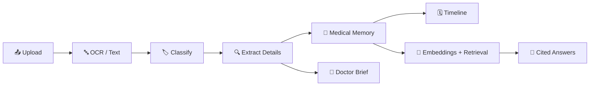

<div align="center">

# 🩺 MEDORA

### AI Medical Memory & Care Companion

**Understand Your Medical Story. Navigate Your Care.**

### 🚀 [Live Website](https://medora-ai-psi.vercel.app) &nbsp;|&nbsp; ⚙️ [Live API](https://medora-api.vercel.app/health)

</div>

---

## 💥 The Problem

Picture a thick folder of medical reports: lab results, prescriptions, discharge summaries, scanned notes. Written in medical language. In scattered pages. Nobody can find anything quickly, and nobody fully understands what it all means.

**MEDORA fixes that.** Upload your records and MEDORA turns them into one organized, searchable, easy-to-understand medical memory, and every answer shows exactly which document it came from.

> ⚠️ **MEDORA is an AI tool for understanding information and finding care. It is not a doctor. It never diagnoses and never prescribes.**

---

## ✨ Features

| | Feature | What it does |
|---|---|---|
| 📤 | **Smart Upload** | Drop in PDFs or photos of reports. MEDORA reads the text (with OCR for scans). |
| 🔍 | **Information Extraction** | Pulls out dates, medicines, lab values and providers, with a **confidence flag** on anything uncertain. |
| 🗓️ | **Medical Timeline** | Every event in date order, each linked back to its source document. |
| 💬 | **Ask MEDORA** | Ask questions about *your own* records and get answers with **cited sources**. If the records don't have the answer, MEDORA says so. |
| 🌍 | **Simple Language** | Hard medical terms explained in **simple English or Roman Urdu**, with a fact-guard that keeps doses, dates and values unchanged. |
| 📄 | **Doctor Brief** | A one-page summary to hand to your doctor, printable as PDF. |
| 🏥 | **Find Care** | Filter sample providers by specialty, location, visit type and cost *(prototype data)*. |
| 🛡️ | **Responsible AI** | Disclaimers on every answer, an emergency detector, and a response guard that blocks diagnosis-style language. |

---

## 🧠 How It Works



Every stage has its own folder in the backend, so the pipeline is easy to follow and easy to improve.

---

## 🛠️ Tech Stack (all free)

| Layer | Technology |
|---|---|
| Frontend | React, Vite, Tailwind CSS, React Router, Axios |
| Backend | Python, FastAPI, SQLAlchemy, Pydantic |
| Database | Neon (serverless PostgreSQL) |
| AI | Google Gemini API (text, embeddings, vision for scans) |
| Hosting | Vercel (frontend and backend) |

---

## 📁 Project Structure

```
medora/
├── frontend/              # React website
│   └── src/
│       ├── components/    # upload, documents, timeline, chat, simplifier, brief, findcare, layout
│       ├── pages/         # Landing, Login, Dashboard, Upload, Documents, Timeline, Ask, ...
│       ├── services/      # all API calls live here
│       ├── hooks/  context/  routes/  utils/  styles/
├── backend/               # FastAPI server
│   ├── app/
│   │   ├── api/v1/endpoints/   # auth, documents, timeline, chat, simplifier, brief, care
│   │   ├── core/  models/  schemas/
│   │   └── services/
│   │       ├── ingestion/      # validate, OCR, classify
│   │       ├── extraction/     # medical extractor, confidence scorer
│   │       ├── memory/         # memory + timeline builders
│   │       ├── rag/            # chunker, embedder, vector store, retriever
│   │       ├── llm/            # one place that talks to the AI model
│   │       ├── simplifier/     # simplifier + fact guard
│   │       ├── brief/  care/
│   │       └── safety/         # disclaimer, emergency detector, response guard
│   ├── data/  scripts/  tests/
├── docs/                  # hackathon document, folder structure PDF, architecture notes
└── sample-data/           # FAKE demo reports only
```
---

## ⚡ Run It Locally

You need **Python 3.11+**, **Node.js 18+**, and a free [Gemini API key](https://aistudio.google.com).

### 1️⃣ Backend
```bash
cd backend
python -m venv venv
venv\Scripts\activate          # Windows  (Mac/Linux: source venv/bin/activate)
pip install -r requirements.txt
copy .env.example .env         # Mac/Linux: cp .env.example .env
# open .env and fill in your values (see the table below)
uvicorn app.main:app --reload
```
Check it: open http://localhost:8000/health

### 2️⃣ Frontend
```bash
cd frontend
npm install
copy .env.example .env         # set VITE_API_URL=http://localhost:8000
npm run dev
```
Open http://localhost:5173 🎉

### 🔑 Environment Variables (backend)

| Variable | What it is |
|---|---|
| `DATABASE_URL` | Postgres connection string (Neon), or `sqlite+pysqlite:///./local.db` for local testing |
| `LLM_PROVIDER` | `gemini` |
| `GEMINI_API_KEY` | Your key from Google AI Studio |
| `GEMINI_MODEL` / `GEMINI_EMBED_MODEL` | Current model names shown in AI Studio (they change often) |
| `JWT_SECRET` | A long random string you generate |
| `CORS_ORIGINS` | JSON list, for example `["http://localhost:5173"]` |
| `RAG_MIN_SCORE` | Minimum similarity before MEDORA answers (default `0.45`) |
| `EMERGENCY_NUMBER` | Text shown in the emergency notice |
| `ENABLE_DEMO` | `true` to enable the demo data loader |

> 🔒 **Never commit a real `.env` file or any API key.** Only `.env.example` files with empty values belong in Git.

---

## ☁️ Deployment

MEDORA runs on a completely free stack:

1. **Database:** create a free project on [Neon](https://neon.com) and copy the pooled connection string.
2. **Backend:** import the repo on [Vercel](https://vercel.com), set **Root Directory** to `backend`, add the environment variables above, and deploy.
3. **Frontend:** import the repo again as a second Vercel project, set **Root Directory** to `frontend`, add `VITE_API_URL` (the backend address, no trailing slash), and deploy.
4. **Connect them:** set the backend's `CORS_ORIGINS` to your frontend address, for example `["https://your-frontend.vercel.app"]`, then redeploy the backend.

---

## 🔌 API at a Glance

| Method | Endpoint | Purpose |
|---|---|---|
| `POST` | `/api/v1/auth/register` · `/login` | Create account, sign in |
| `POST` | `/api/v1/documents/upload` | Upload a report |
| `GET` | `/api/v1/documents` · `/{id}` | List and view documents |
| `DELETE` | `/api/v1/documents/{id}` | Delete a document and its data |
| `GET` | `/api/v1/timeline` | Medical events with source links |
| `POST` | `/api/v1/chat/ask` | Question in, cited answer out |
| `POST` | `/api/v1/simplify` | Explain text in simple English or Roman Urdu |
| `POST` | `/api/v1/brief/generate` | Create the Doctor Brief |
| `GET` | `/api/v1/care/search` | Filter sample providers |
| `GET` | `/health` | Server health check |

---

## 🛡️ Responsible AI & Privacy

- 🔗 **Every answer shows its source** document.
- 🟡 **Uncertain values are flagged** with "Check against original".
- 🚫 **No diagnosis, no prescriptions.** A response guard rewrites unsafe wording.
- 🚨 **Emergency words** trigger a notice to contact local emergency services.
- 🧪 **Use fake data only.** Free AI tiers may use prompts for model training, so never upload real patient records to this prototype.
- 🏥 **Find Care uses sample providers** and is clearly labeled "Prototype".

---

## 🧭 Known Limits (Free-Tier Reality)

- Gemini's free tier has rate limits that can change, so heavy use may be throttled.
- The Neon free database pauses when idle, so the first request after a quiet period can be slower.
- Find Care is a prototype with sample data, not a verified directory.

---

## 🗺️ Roadmap

- [ ] Verified provider directory
- [ ] Compare reports over time
- [ ] "Story" view of the patient journey
- [ ] More languages
- [ ] Stronger privacy controls for real-world use

---

## 🏆 Built For

A hackathon project, made with energy and a lot of coffee by **Astreonix**. Read the full project document in [`docs/`](docs/).

<div align="center">

### ❤️ If MEDORA helped you understand a report a little better, drop a ⭐ on the repo!

**MEDORA: Your records. Your language. Your story.**

</div>
